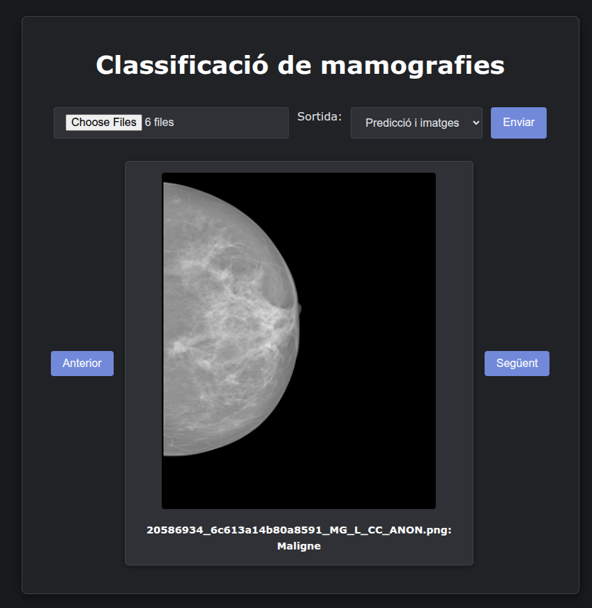

# Mammography Classification with ViT and Swin Transformer
This project aims to develop a deep learning-based system for the classification of mammographic lesions using Vision Transformers (ViT) and Swin Transformers (SW-Transformer), applied to the INbreast dataset.

## Project Structure

### EDA_inbreast.ipynb

This notebook performs Exploratory Data Analysis (EDA) on the INbreast dataset, which contains mammographic images with clinical annotations.

**Key features:**

- Loading and displaying DICOM images.
- Extraction of clinical metadata.
- Visualization of lesion distribution (benign vs malignant).
- Data preparation for model training.

### entrenament_vit_swtransformer.ipynb

This notebook implements the training pipeline for classifying breast lesions using Vision Transformers and Swin Transformers through transfer learning.

**Key features:**

- Image preprocessing and augmentation.
- Loading of pretrained models (ViT, Swin-T).
- Training and evaluation with metrics such as accuracy, precision, recall, and AUC.
- Visualization of training curves and performance results.

## Web Application

To facilitate professional use, a minimalist web app was developed for mammography classification. Users can upload one or multiple images and choose between two result visualizations:

- **List view**: shows only the classification.
- **Interactive view**: shows the original images and predictions in a carousel.

The frontend is defined in `index.html` and styled via `style.css`, using soft tones to reduce visual fatigue in clinical environments.

*Figure: Example - Prediction with image*

### System Pipeline

1. **Image upload** – User uploads images via the web app.
2. **Preprocessing** – Images are processed automatically (`preprocess.py`).
3. **Classification** – The model predicts the class (`best_model.pth`).
4. **Display** – Results are shown using the selected format.

### App Structure

- `preprocess.py`: image preprocessing functions.
- `app.py`: Flask backend for classification and API.
- `index.html` & `style.css`: frontend interface.
- `best_model.pth`: pretrained model weights.  

## Requirements

You can install all required packages using:
*pip install -r requirements.txt*

## Notes
- The pipeline is adaptable to other mammography datasets with similar labeling formats.
- "This project is part of the Master's Final Project by Marc Bracons Cucó at the Universitat Oberta de Catalunya (UOC). 
